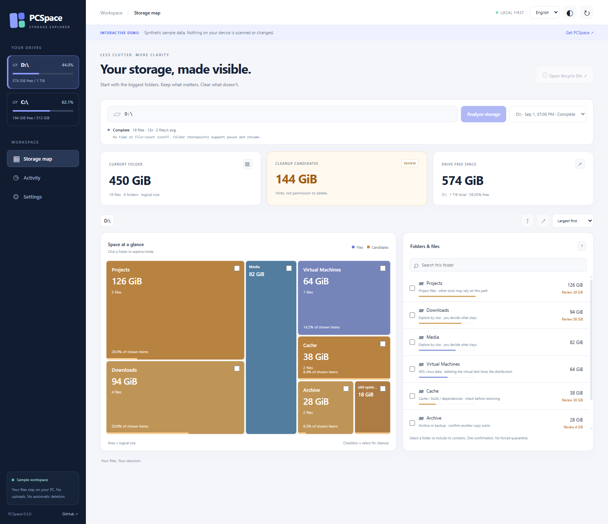
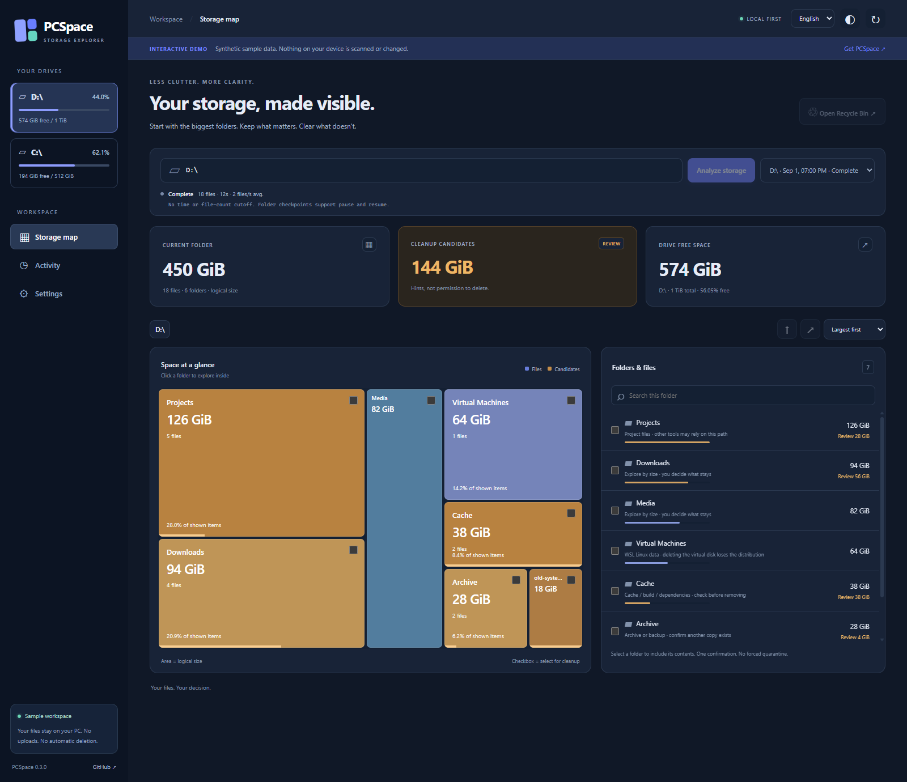

# PCSpace

### A clearer view of your storage.

**Explore large folders. Understand cleanup candidates. Decide what stays.**

[한국어](README.ko.md) · [Interactive demo](https://sionchu.github.io/pcspace/) · [Download](https://github.com/sionchu/pcspace/releases) · [Report a bug](https://github.com/sionchu/pcspace/issues)




PCSpace is a **local-first Windows storage explorer** with an interactive treemap. Start at a drive, drill into large folders, compare cleanup hints, and recycle or permanently delete selected items with one confirmation. No account, AI service, extra local password, Node installation, or Remote Desktop Commander connection is needed to use it.

> **Public preview, not a backup tool.** Candidate labels are hints, not permission to delete. Permanent deletion cannot be undone. The online demo is read-only synthetic data and cannot access your computer.

## Start in a minute

1. Install **Python 3.12+** on Windows 10/11, with the Python launcher or Python on PATH.
2. Download `PCSpace-0.3.0-source.zip` from [Releases](https://github.com/sionchu/pcspace/releases) and extract it.
3. Double-click **`Start-PCSpace.cmd`**.

The first launch creates a private `.venv` and downloads the Python dependencies. Later launches reuse it. Your browser opens at **`http://127.0.0.1:8768`**. Keep the console open; Ctrl+C stops the app. No administrator permission is required. This release is source-based, not a standalone EXE.

### For developers

```powershell
git clone https://github.com/sionchu/pcspace.git
cd pcspace
python -m venv .venv
.venv\Scripts\python -m pip install -e ".[dev]"
.venv\Scripts\python -m pcspace --open
```

Runtime dependencies are declared once in `pyproject.toml`. There is no frontend build step or external font/CDN dependency. Wheels are provided in Releases; this project has not been published to PyPI.

## What it does

| Feature | Behavior |
|---|---|
| Folder-first treemap | Area represents logical size; click a folder to drill down. A synchronized list shows size and candidate share. |
| Candidate hints | Generated/dependency folders and older temporary/archive formats are highlighted. Large size alone does not make a file junk. |
| Resumable analysis | No fixed time or file-count cutoff. Pause/resume uses directory checkpoints, with partial results labeled. |
| Direct cleanup | Select files or folders, review one confirmation, recycle or permanently delete. No mandatory written justification or quarantine. |
| Clear boundaries | System/credential/cloud/reparse and explicitly protected paths remain excluded; projects and backups are not categorically locked. |
| WSL explanations | Ubuntu Store package data and `ext4.vhdx` are explained as Linux distribution data, not generic junk. No WSL disk compaction is performed. |
| Private by default | Loopback-only server, same-origin request checks, no analytics, no file upload, no AI calls. |
| Visual preferences | English/Korean UI, light/dark themes, keyboard focus states and mobile layout. Some low-level diagnostics remain Korean. |



## Online demo vs. your PC

The [demo](https://sionchu.github.io/pcspace/) uses the same interface with an **in-memory fictional dataset**. It sends no requests to a PCSpace backend, and scan/delete/protect actions cannot run. You can also open `http://127.0.0.1:8768/?demo=1&lang=en` in a local installation.

The installed app processes files **on the computer running Python**. Opening a GitHub page does not grant that page access to your disk. Publishing this source does not expose an existing installation.

## State, updates and remote access

Scan records, policy and operation history live in `%LOCALAPPDATA%\PCSpace`, outside the repository. Do not publish that directory. UI theme/language preferences alone are saved in browser local storage. Files are never automatically cleaned up.

Before updating, let cleanup finish, pause any scan and close the app. Extract the new source into a clean folder, or `git pull --ff-only` in an unmodified clone, then launch again. Keep the state directory. Avoid running different versions against the same state simultaneously.

Remote access is optional: use **private Tailscale Serve**, add your private HTTPS origin and exact owner login to the local `policy.json`, and keep the backend on loopback with `proxy_headers=False`. Do **not** enable Funnel or public port forwarding. There is no shared public password. See [SECURITY.md](SECURITY.md) for the trust model. Remote configuration is manual in this preview.

## Limits worth knowing

Sizes are **logical bytes**, not guaranteed recoverable capacity. Hardlinks, compression and sparse disks can differ from actual allocation. Excluded paths are not included in scan totals. Large drives still require directory enumeration; there is no Everything/MFT integration. Candidate hints do not understand application dependencies or backup value.

Missing paths are filtered when you navigate or refresh. A successfully deleted folder updates its selected completed scan; concurrent/external changes or individual file removals can require rescanning for accurate totals. Recycle items consume disk space until the Windows recycle bin is emptied. The app has no permanent-delete undo and is not an OS security sandbox.

Windows is the supported desktop target. Linux CI exercises core logic, not a supported Linux recycle/desktop workflow. There is no automatic update service, scheduled cleanup, duplicate-content engine, or cloud-placeholder release feature.

## Verify and contribute

```powershell
python -m pytest -q -rs
node tests/ui_state_test.mjs
node tests/demo_test.mjs
node tests/browser_e2e.mjs
python -m build
```

Node 22+ and Chrome/Edge are needed **only for browser development tests**, not normal use. Tests create disposable fixtures. See [validation](TEST_REPORT.md), [contributing](CONTRIBUTING.md), and [changelog](CHANGELOG.md).

## License and acknowledgements

PCSpace is [MIT licensed](LICENSE). Dependencies keep their own licenses. The Windows recycle integration uses Send2Trash's BSD-licensed progress-sink interface and pywin32. Design inspiration: [Everything ES](https://github.com/voidtools/ES), [Czkawka](https://github.com/qarmin/czkawka), [BleachBit](https://github.com/bleachbit/bleachbit), [dua-cli](https://github.com/Byron/dua-cli), and [organize](https://github.com/tfeldmann/organize). These applications are not bundled or required.
